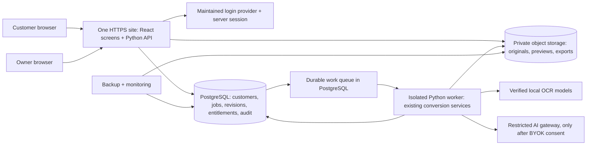

# Dockling: production SaaS plan

**Status:** proposal for owner review, 10 October 2026 (Asia/Dhaka). Based on `web-frontend` commit `d24cbf5`. This plan covers a customer-facing service, not merely a hosted copy of the sample frontend. No backend, billing, or public deployment is claimed complete by this document.

## 1. The product we are building

A customer signs in to a private workspace, uploads a bank or card statement, sees the original beside extracted transactions, corrects any problems, confirms source checks, and downloads usable Excel, CSV, QuickBooks, Xero, or OFX files. The owner has separate tools for support, bank profiles, configuration, pricing, diagnostics, usage, and exceptional cases. A customer can bring their own compatible AI provider if they choose; ordinary extraction does not require an LLM key.

Start with **invited bookkeeping teams and small businesses** handling bank/card statements. Keep the interface understandable for an individual owner, while allowing a workspace to have several authorized people. The first commercial launch covers bank/card documents and the six existing output types. Invoices, live bank feeds, live accounting sync, tax advice, and automatic claims of certified accuracy are separate products or later proposals. Unknown layouts must lead to a reviewable result or a clear failure, never a plausible-looking fabricated export.

Keep the current calm, colorful visual system and improve trust and clarity through real status, contextual help, readable review flags, and polished empty/error states. Do not make a customer learn the operator's command vocabulary to complete a conversion. Test the upload-to-download path with first-time users before finalizing marketing claims.

“10/10” means passing the release gates in section 7 with real end-to-end evidence. Visual polish is already a strength; security, accuracy, privacy, reliability, and a functioning buying journey determine whether the app is sellable.

## 2. What exists and what is missing

| Layer | Evidence in repository | Production gap |
|---|---|---|
| Browser experience | `frontend/`: React/TypeScript/Vite, customer/admin screens, 36 unit and 18 browser tests, 14 routes checked at desktop/phone sizes | In-memory fixtures, role selector, fixed sample downloads; no real account, upload, provider key, or conversion |
| Conversion engine | `src/stmtconv/`: Python 3.12 Decimal financial core, intake, text/Docling OCR, review, six exports, merge/categories, optional BYOK, delivery/deletion; 314 Python tests at frontend milestone | Services assume one operator and local order folders; no authenticated web/worker boundary or multi-customer storage |
| Job and document state | `orders/store.py`, `order.json`, per-order `input/work/review/output/delivery` paths | Local manifest/file lock cannot be the only source of truth across web servers/workers; cloud objects, backups, concurrency, and ownership need explicit treatment |
| AI provider settings | Private local provider file and CLI consent/page budget | That file is not a hosted vault. Keys must be encrypted per workspace, never returned to the browser, and all outbound destinations controlled |
| Commercial/operations | Operator quotes, basic help and preview pricing page | No approved SaaS plans, payment, entitlements, support channel, hosting, monitoring, recovery, legal text, or verified import tests |

The existing [web-app plan](WEB-APP-PLAN.md) remains the feature inventory; [frontend coverage](FRONTEND-COVERAGE.md) lists every current control and integration gap. Its SQLite/single-filesystem suggestion is appropriate only for a tightly limited one-server local pilot. **For the requested multi-customer sellable SaaS, use PostgreSQL and private object storage from the first real hosted build.** This is a proposed architectural update for review; it does not change the existing CLI.

## 3. Recommended architecture

In plain language: **React shows the screens; the Python API checks who may do each action; a separate Python worker performs the slow conversion; PostgreSQL records what happened; private object storage holds the documents and downloads.** The browser and API use one HTTPS origin. The owner’s CLI remains useful for local work and diagnostics.

| Design choice | Why it fits Dockling | Boundary to implement |
|---|---|---|
| React/TypeScript frontend already built | Reuse the approved UX; no JavaScript rewrite of the financial engine | Replace demo state and role switch on real routes. Define an OpenAPI contract, generate/validate client types, show genuine loading/errors/progress, and keep the public fictional sample separate. |
| FastAPI in Python | Calls the existing Pydantic/Decimal core directly; matches the current Python tests | Thin routes only: authentication, authorization, input validation, idempotency, and application-service calls. No financial rules in route handlers or JavaScript. |
| PostgreSQL as authoritative metadata store | Durable transactions and workspace scoping suit customers, review revisions, jobs, payments, and audit | Define `users`, `workspaces`, `memberships`, `jobs`, `files`, `statements`, `review_revisions`, `operations`, `connections`, `usage_events`, `entitlements`, and `audit_events`. Give every private row a workspace ID. Enforce workspace ownership server-side on every access; test it exhaustively. |
| Private S3-compatible object storage | Originals, page previews, review workbooks, six outputs, and delivery ZIPs need durable private storage | Opaque server-generated keys; no public bucket. The API authorizes source/exports before streaming. Track object hashes, current revision, size, retention, and cleanup state. |
| Separate CPU worker with a database-backed queue | OCR is slow and model-heavy; a web request must remain responsive | One worker initially, with bounded concurrency, heartbeats/leases, idempotent stages, resource/time limits, explicit retry and interruption states. A durable job claim can use PostgreSQL row locking; never keep one database transaction open throughout OCR. Add another queue system only if measured load warrants it. |
| Maintained OpenID Connect identity provider and server sessions | Invites, login recovery, MFA, and revocation need maintained security behavior | Choose the provider after region/price review. `HttpOnly`, `Secure`, `SameSite` session cookies; CSRF tokens for writes; server-controlled roles and session expiry. Owner/admin actions require MFA and separate auditable authorization. |
| Hosted payment provider, chosen for the owner's merchant country | Card details should stay with the payment provider | Use real hosted checkout/portal, signed idempotent webhooks, entitlements, invoice/refund/cancellation rules; decide provider only after eligibility, fees, and tax handling are verified. Manual paid pilot invoicing is acceptable before self-service checkout, but a “Buy” button must never lead to a simulated purchase. |

### Preserve the current engine without two competing job records

Today the Python services load and edit `order.json` and files through `orders/store.py`; the review workbook, extraction, delivery, and deletion services also call that store. Do **not** just put FastAPI around CLI commands while allowing both local files and PostgreSQL to claim authority. Extract a typed service/repository boundary. Keep the local filesystem implementation for the CLI. Give the web application a PostgreSQL implementation for status, revisions, history and ownership, and an object-storage implementation for artifacts. Add contract tests that run the same financial and review cases through both adapters. If a temporary local working folder is needed for Docling, create it per worker job, protect it, and remove it after publishing verified artifacts.

The core keeps `Decimal` money; API values are exact decimal strings. A browser edit is a complete typed batch with an expected revision. One database transaction either saves the whole batch and its actor/history or changes nothing. Every relevant edit invalidates current source checks, exports, and download permissions. Financial reconciliation and source comparison remain separate. `UNVERIFIABLE` export is owner-only with a reason and audit event, never a regular customer bypass.

### Durable processing and honest progress

The API records upload metadata and a queued operation in one transaction after the private object is stored; unreferenced partial uploads are swept safely. The worker claims a short lease, checks the job/revision, runs one stage, writes temporary artifacts, verifies them, then publishes the artifact pointer and new state. A crash or restart must resume only an idempotent stage. A provider call with an uncertain result stays reserved in the AI page budget and needs safe reconciliation before retry; it must not silently spend or send twice. Queue wait and OCR stage are shown honestly. No percentage appears until worker instrumentation measures actual progress.

The hosted viewer opens authorized source pages privately, with page/engine/flag provenance and zoom. It shows OCR boxes only if genuine coordinates exist. Browser and Excel review use the same server-side edit/revision rules. Generic, QuickBooks 3/4-column, Xero, Excel, OFX, merged monthly workbook, category rules, quotes, package hashes, source-check gates, and deletion logic all remain in the release checklist. The two-row sample currently bundled with the frontend cannot substitute for these real outputs.

### Privacy and optional BYOK

Store provider keys as encrypted ciphertext with a deployment-held encryption key or managed key service; separate ciphertext, key version, workspace, and audit metadata. Keys never enter the JavaScript bundle, URLs, queue records, normal API responses, logs, or support exports. A customer can add an HTTPS OpenAI-compatible endpoint, discover or enter a model, see only documented effort levels (including Max when evidenced), inspect provider terms, and grant per-job consent with a page cap. Changing provider/model/effort renews consent without resetting usage. Metadata tests send no statement content. Any paid synthetic completion test asks the owner/customer explicitly and displays possible cost first.

Hosted custom endpoints need server-side public-address validation, DNS rechecks, redirect limits, and a controlled outbound gateway so a provider URL cannot reach internal services. The processing worker has no general internet route. Send only minimized/masked eligible table cells; if no safe cells exist, offer manual/profile review. Keep AI output untrusted until source review and financial validation pass. Review the actual provider’s privacy terms before enabling it for customer documents.

Retention covers **all** originals, derived pages, temporary uploads, worker scratch files, exports, ZIPs, secrets, previews, and object versions. Deletion is an inventory-driven job with retry; a partial failure produces no success certificate. Explain backup retention separately: a successful live-data deletion is not a claim that immutable backups vanished immediately. Encrypt backups, set a documented expiry, and test restoration and purge behavior. Retained anonymous metrics and audit entries must not contain transaction text, keys, account identifiers, or amounts.

## 4. Implementation sequence

These are **new web/SaaS phases**, separate from the original Python CLI phases 0–10, which have already been implemented in the cloud. They expand the older web plan's Stages C–F into specific hosted-product milestones. Phase numbers here do not reopen or erase the earlier CLI work.

Each numbered phase ends with a reviewable GitHub branch/commit, tests and evidence. Keep `main` untouched until a merge is approved. Early phases use synthetic statements and fake providers; first real-customer data waits for the privacy/security gates.

| Phase | What we build | Completion evidence / exit gate |
|---|---|---|
| 0. Product and design decisions | Fix the first paying audience, region/data location, retention/backup promise, plan limits, support channel, merchant/payment eligibility, and monthly operating budget. Benchmark OCR memory/time on representative digital/scanned documents; map all 33 current feature rows to endpoints, roles, storage, and tests. Freeze OpenAPI, roles, state machine, deletion inventory, threat model and data-flow diagram. | Written decisions, measurable capacity/cost model, vendor shortlist, full endpoint/permission matrix. No real client documents required. |
| 1. Secure foundation | PostgreSQL migrations, workspace/membership records, invite-only identity, server sessions/CSRF, owner MFA, private object store, API skeleton, shared local/hosted service boundary, request/response validation and CI. Replace the preview role picker in real mode. | Two distinct test workspaces cannot see, change, download, or even learn the existence of each other’s jobs/files/keys. Restart preserves state. Original Python and frontend tests remain green. |
| 2. Real documents and worker | Streaming uploads with signature/password/size/page checks; private originals and page previews; queued text/Docling extraction, failure and restart recovery, truthful stage indicators; quote/limits before processing. Run on synthetic PDFs, scans and photos. | In a browser, a genuine uploaded synthetic PDF produces real statement rows and source pages. Content differs when the input differs. Crash/restart does not lose or duplicate work; rejected/malicious samples are contained. |
| 3. Review, outputs and privacy | Shared browser/Excel fix/delete/insert/clear commands; source confirmation and deterministic spot-check; all six live outputs, import dates/QB chunking, OFX identity, merge/monthly workbook, categories, package/version/hash checks; deliver, abandon, retention/deletion and partial retry. | Real PDF → revision-aware correction → source check → six outputs → authorized download/package → verified live-data removal. Stale edits/files fail, all financial gates match CLI results, and deletion certificate is withheld on a forced failure. |
| 4. BYOK and owner operations | Encrypted per-workspace connections, manual/discovered models, capability-based Max, consent/terms/page caps, safe egress, bounded retries; owner profile testing/scaffolding, price/config versioning, model/health/selftest, support access with audit, anonymous metrics. | Cross-workspace keys stay inaccessible; all AI gate and SSRF tests pass with fake providers. Real provider/terms and paid inference remain an explicit later owner check. Admin changes are permissioned, validated, reversible and audited. |
| 5. Sellable account and plan experience | Customer onboarding, workspace/team invitations, quotas/usage, approved plans and quote language, support/help, transactional status notices, billing entitlement ledger. Integrate a merchant-eligible hosted checkout/portal or launch a clearly labelled manual-invoice paid pilot first. | Real test-user journey from invitation to fulfilled conversion; payment sandbox covers successful/failed/refunded/cancelled cases, duplicate/out-of-order webhooks, access changes, and receipts. No price or checkout is published until approved and functioning. |
| 6. Security and operating readiness | Independent threat/security review, dependency/model/license review, backups/restore drills, observability/alerts, incident and support runbooks, image/model build pipeline, resource limits and cost caps, migration/rollback rehearsal, accessible UX review. These checks also run continuously during phases 1–5. | No open critical/high security finding. Tenant and admin negative tests, document parser abuse tests, worker crash/duplicate-payment tests, backup restore, retention/partial-deletion drills, keyboard/screen-reader review, and measured load targets pass. |
| 7. Staging and permitted field validation | Reproducible staging matching the intended production topology; fresh-device/local setup; owner tests with explicitly permitted bank/card samples and actual Excel/QuickBooks/Xero/OFX imports. Measure review time, accuracy by layout, OCR resource use, queue delay, support burden and real per-job cost. | End-to-end hosted synthetic tests pass; real-layout/import limits documented; unit economics and provider terms validated; support/contact and privacy/legal text work. Do not promise every bank or layout is supported. |
| 8. Controlled launch and improvement | Invite a small paying pilot cohort, observe a full statement/billing/retention cycle, fix findings, then decide on broader release and whether to merge to `main` or publish. | Section 7 release gates passed with recorded evidence and owner approval for external publication. Commercial claims reflect measured product behavior. |

Phases 1–3 deliver a local working app; phases 4–7 make it safe and operational as a multi-customer service. Billing can begin as a manually fulfilled paid pilot when the customer work is real and protected. A self-service paid launch waits for a supported payment provider and tested checkout. No phase may quietly omit an existing advanced/admin feature: record a tested implementation or a clearly disclosed launch exclusion in [the coverage ledger](FRONTEND-COVERAGE.md).

## 5. Hosting and cost decisions

A development laptop or free static site can show the React preview. Real OCR needs a continuously available Python worker with enough measured CPU, RAM and local model space, plus a database, private durable storage, backups, monitoring and secure network routes. Those resources and support time have ongoing cost. BYOK means customers pay their chosen provider’s inference charges; it does not remove Dockling’s hosting and storage costs.

The first production topology should be **one HTTPS application service, one independently restartable CPU worker, managed PostgreSQL, private object storage and separate backups**, in one chosen region. Select actual vendors after benchmarking the pinned Docling wheels, especially on ARM versus x86, memory peaks, model startup and sustained page throughput. A free tier can help with synthetic staging; do not assume it offers persistent workers, backups, a service guarantee or enough OCR memory. Oracle Always Free/ARM, Cloud Run and Render need current eligibility/limits and artifact compatibility checked before selection. A smaller paid always-on host may be simpler for the first paying cohort. Record monthly infrastructure cost at idle and at expected usage, backup/egress cost, merchant fees and support hours before publishing prices.

For every plan define pages/month, per-upload size/pages, simultaneous jobs, output retention, team seats, support level and what happens at the limit. Count usage from idempotent server events. Use measured CPU/storage/traffic/review costs plus margin; the CLI’s historical $10–15/$30–40/$80–100 service quotes are **not** approved SaaS subscription prices.

## 6. Security and service rules that apply in every phase

- Treat PDFs, images, filenames, workbook cells, provider output, and webhooks as untrusted data. Sniff real content; impose byte/page/time/memory limits; sandbox parser work; neutralize spreadsheet formula injection and never execute document instructions.
- Check authenticated workspace ownership and role for every query, artifact stream, job operation, connection, billing event and admin action. Opaque IDs help privacy but never replace authorization. Return a nonrevealing response for someone else’s IDs. Consider database row-level security as a second barrier, with tests proving the application role cannot bypass it.
- Protect login and recovery with a maintained identity provider, MFA for owner/admin, rate limits, session expiry/revocation, CSRF, HTTPS and secure headers. Use structured audit events without private statement content. No real customer access through the preview role selector.
- Keep server credentials and encryption keys in managed secrets, not Git or frontend environment variables. Restrict provider egress, verify TLS, and test key replacement/revocation and cost caps. Do not send a real provider request during automated tests.
- Use exact decimal strings at the API and `Decimal` in the engine; one authoritative revision for review/source/export; server rejects stale or bypassed actions. Audit exceptional exports with actor and reason.
- Pin and review new dependencies and model terms, scan builds, and produce a repeatable deployment. Encrypt data in transit/at rest. Test backup restoration and disaster recovery against an agreed recovery-time/data-loss target before offering a public service commitment.
- Agree with a qualified advisor on privacy notice, terms, processor/subprocessor disclosures, merchant eligibility and applicable data protection obligations for the chosen customer region. Do not display compliance badges or deletion promises that have not been verified on the selected host.

## 7. Release scorecard: what “production ready” means

All rows must pass with recorded evidence. Any critical security, privacy, billing, or financial-correctness failure blocks the paid launch.

| Area | Required evidence before a broad paid launch |
|---|---|
| End-to-end usefulness | Browser tests on real synthetic digital, scanned and photo-like statements, plus permitted field samples; every relevant feature in the coverage ledger has a verified path. Unexpected layouts ask for review or fail clearly. Users can obtain and import the promised outputs. |
| Financial trust | Python Decimal/golden tests remain green; browser and workbook edits have parity; balance/totals/coverage, current source checks, account identity, review revision and export hash gates reject bypasses. Source dates/descriptions are never declared proved by financial reconciliation. |
| Customer isolation | Automated two-workspace tests cover jobs, pages, downloads, search, AI keys, admin APIs, background jobs and deleted/stale links; authorization is verified server-side and audited. External security review findings are closed or launch-blocked. |
| Privacy/deletion | Data inventory and notices match actual flows, including AI provider terms and backup expiry. Delete/retry drills remove live and temporary objects; a failed removal issues no certificate. Key/secret and log scans find no customer content or credentials. |
| Reliability and recovery | Forced worker/API restart and object/DB failure tests show no duplicate job, export or provider charge. Restores and schema rollback are rehearsed. Choose and measure an availability, restore-time and maximum-data-loss target before promising one. |
| Capacity and cost | Measured p95 page/API timings, OCR peak RAM, queue delay and simultaneous-job limit on selected hosting; load tests at the proposed customer/page cap; documented idle and per-job costs. Alerts fire for queue backlog, failure, backup, storage and deletion-pending cases. |
| Buying and support | Approved truthful offer and working contact route; merchant-eligible checkout with signed webhook/entitlements or a documented manual paid pilot. Help, import instructions, refund/cancellation and support escalation have real owner actions. |
| Usability/accessibility | Representative first-time users complete upload → review → download with documented help. Desktop/mobile keyboard, focus, screen reader and WCAG 2.2 AA checks are reviewed, including error, empty, slow, expired and payment states. |
| Operations | CI builds and scans; staging and production configuration are reproducible; model hashes are verified; release and rollback runbooks, monitoring, support access, on-call ownership and incident response are exercised. |

Current 314 Python tests and frontend checks are a strong baseline, not proof of these hosted gates. Track the number of real layouts, measured correction rate, processing time and import success by format. Record unsupported cases and issue causes; do not manufacture an “accuracy percentage” from the two-row preview.

## 8. Decisions for the owner to review

The architecture above is my recommended default. These product choices influence spending and legal wording; they need explicit answers before their corresponding implementation phase, while foundational engineering can proceed independently:

1. **First buyers:** bookkeeping firms and small businesses are the default. A different first sector changes workflow and pilot samples.
2. **Data location and first market:** choose where customers and documents may be hosted; this affects identity, object storage, legal terms and provider choice. No country is inferred from the owner’s timezone.
3. **Pilot sales:** invite-only manually invoiced paid pilot first, then self-service checkout after merchant eligibility and demand are known, is the default. If instant online purchase is required at launch, payment selection and testing move earlier.
4. **Retention and support promises:** approve default live-data retention, backup expiry, support contact/hours and acceptable recovery targets after seeing host costs. The local CLI’s seven-day preference cannot automatically become a truthful cloud backup promise.
5. **Budget and capacity:** set a maximum monthly hosting spend and a first-cohort size. Use the phase-0 benchmark to choose infrastructure and limits, then adjust before publishing prices.

After this plan is reviewed, the first implementation slice is Phase 0’s contracts/threat model and Phase 1’s workspace/auth/database boundary. It should produce a working, isolated two-workspace synthetic API before touching real customer files. The existing frontend remains the visual starting point throughout.

## 9. Basis for the architecture

Repository evidence: [existing technical architecture](TECH_ARCHITECTURE.md), [web-app feature plan](WEB-APP-PLAN.md), [frontend coverage](FRONTEND-COVERAGE.md), [progress and tested limits](PROGRESS.md), plus `src/stmtconv/orders/store.py`, `review/service.py`, `ai/providers.py` and `frontend/src/lib/api.ts`. These files establish the local-folder assumption, revision/consent logic, and current demo/API boundary.

Current official references checked for planning on 10 October 2026: [FastAPI background-task caveat for heavy distributed work](https://fastapi.tiangolo.com/tutorial/background-tasks/), [PostgreSQL `SKIP LOCKED` queue-like row locking](https://www.postgresql.org/docs/current/sql-select.html), [OWASP File Upload Cheat Sheet](https://cheatsheetseries.owasp.org/cheatsheets/File_Upload_Cheat_Sheet.html), and [OWASP ASVS](https://owasp.org/www-project-application-security-verification-standard/). Vendor pricing/availability, merchant country support and legal requirements must be rechecked when providers and markets are selected.
