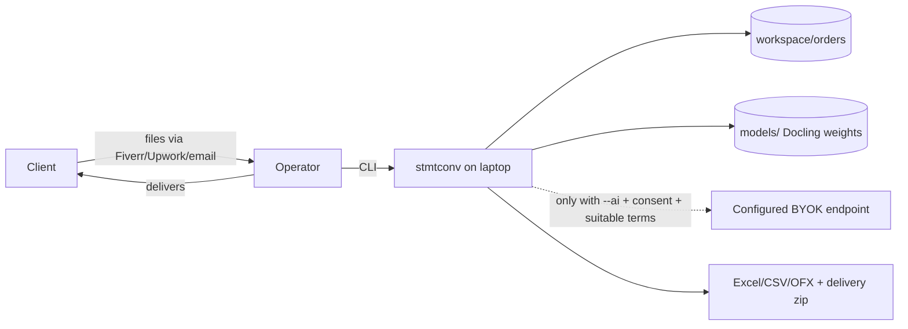
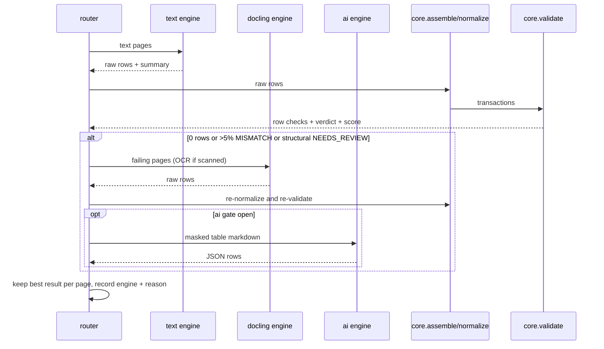

# Technical Architecture — Statement Converter

> Derived from `docs/SPEC.md` (Sections 3, 4, 6–15) and `docs/DECISIONS.md`. If this document conflicts with SPEC, SPEC wins.

## 1. System context


No other outbound connections during order processing. Model download happens once via `stmtconv models download`.

## 2. Runtime
Single Python 3.12 process per command inside `.venv`. Docling models loaded lazily, once per command run. Default threads 4 (i5-8250U). No services, no containers, no database.

## 3. Repo structure

```
pyproject.toml
scripts/check.py                  lint/format/type/test gate (PowerShell-friendly)
run.bat                           drop-folder launcher (Phase 10)
config/                           settings.yaml, pricing.yaml, categories.yaml, exports.yaml
profiles/                         bank layout YAMLs (generic.yaml + per layout)
templates/                        delivery_note.md, data_handling.md, verification_summary.md, deletion_certificate.md
src/stmtconv/
  __main__.py                     python -m stmtconv
  config.py                       pydantic-settings (only env reader)
  logging_setup.py                JSON logs + redaction filter
  errors.py                       StmtconvError hierarchy with codes
  cli/                            Typer app, one module per command group; messages.py
  core/                           PURE: models, money, dates, text, assemble, validate, verdict, merge, categorize
  orders/                         manifest model, atomic IO, state machine, workspace paths, ledger
  intake/                         sniffing, hashing, page analysis, passwords, photos→PDF, quote
  profiles/                       schema, loader, detector, scaffold helper
  extract/                        base.py (Extractor protocol), text_engine.py, docling_engine.py, ai_engine.py, router.py, summary.py
  export/                         excel.py, qb_csv.py, xero_csv.py, generic_csv.py, ofx.py, templates.py, package.py
  review/                         workbook.py, apply.py, spotcheck.py
  privacy/                        redact.py, mask.py, ai_gate.py, deletion.py
tools/synth/                      synthetic statement generator + layouts + scan simulation
tests/
  unit/ …                         mirrors src modules
  golden/                         expected CSV/OFX fixtures (synthetic data only)
  e2e/                            selftest-style full pipeline tests
workspace/                        runtime data (git- and kilo-ignored)
models/                           Docling artifacts (ignored)
```

**Dependency direction:** `cli → (orders, intake, extract, review, export, privacy) → core`; `extract → (profiles, privacy, core)`; `export → (core, orders)`; `core` imports nothing internal except `errors`. Only `extract/ai_engine.py` may import a network client. Only `config.py` reads environment variables.

## 4. Command handling pattern
1. Typer parses args → `config.load()` (fail fast on invalid config).
2. Load order manifest; check allowed state for the command (`orders.require_state`).
3. Call one service function (e.g. `extract.run_order(order, options)`).
4. Service writes artifacts under the order folder and returns a typed report.
5. `orders.transition()` updates status atomically; timings recorded.
6. CLI renders the report (Rich), exit code 0/1. Errors: `StmtconvError(code, message, hint)` → printed hint, logged with code, no client data.

## 5. Key data flows

### 5.1 Extract (per statement)

Artifacts: `work/<statement>/raw_<engine>.json`, `work/<statement>/transactions.json`, `work/<statement>/validation.json`, Docling JSON export per file.

### 5.2 Review round trip
`review` → write workbook from `transactions.json` + `validation.json` → operator edits → `apply-review` reads fix columns (strict types; row-numbered errors) → apply actions → `fixed_by=review` → re-validate → verdict update → `manual_fixes` count.

### 5.3 Export & deliver
Export checks: every statement verdict not `NEEDS_REVIEW` (or `--allow-unverified`), spot-check recorded (or `--skip-spotcheck`). Writers run per `order.outputs`; `deliver` renders templates with order data, zips `output/` + texts.

### 5.4 Close
Delete order subfolders → verify empty → strip manifest to allowed fields → write certificate → append ledger line.

## 6. Core data model (in `stmtconv.core.models`)
- `RawRow`: page, y, cells{date, description, debit, credit, amount, balance: str|None}, engine, raw_text, date_inherited.
- `Transaction`: row_id (stable `s<statement>-r<n>`), date, description, debit, credit (Decimal|None), balance (Decimal|None), amount (signed Decimal), page, source_file, engine, raw_text, flags[], fixed_by, category.
- `RowCheck`: row_id, status (OK|MISMATCH|UNVERIFIED), expected, difference.
- `StatementSummary`: account_mask, period_start/end, opening, closing, total_debits, total_credits, currency, direction.
- `Statement`: id, file, pages, profile_id, summary, transactions, checks, statement_flags, verdict, engine_by_page.
- `Verdict` enum and flag enum per SPEC 8–9.

## 7. Engine details
- **text:** pdfplumber `extract_words(keep_blank_chars=False, use_text_flow=False)`; y-line clustering tolerance from profile (default 3 pt); header row = line where ≥ 3 alias matches; column boundaries = midpoints between header word x-centers unless profile fixes ranges; amounts right-aligned → assign by x1.
- **docling:** one `DocumentConverter` per run with `PdfPipelineOptions` (table structure on, ACCURATE mode, OCR on only for scanned files/pages, RapidOCR, accelerator CPU with `num_threads`), `artifacts_path` from config; tables exported to cell grids, header mapped with profile aliases; confidence grades stored per page. Verify exact option names against the installed Docling version before use (rule 01).
- **ai:** google-genai client, JSON response schema = list of RawRow cells; temperature 0; timeout 60 s; 2 retries with backoff.

## 8. Storage layout (per order)
```
order.json
input/<original names>
work/pages/<file>-p<n>.png          (only when needed: OCR, previews, demo assets)
work/<statement-id>/raw_text.json | raw_docling.json | raw_ai.json
work/<statement-id>/transactions.json | validation.json
work/docling/<file>.json
review/<statement-id>-review.xlsx
output/<order>-<acct>-<period>.xlsx | -qb3.csv | -qb4.csv | -xero.csv | .csv | .ofx | -merged.xlsx
delivery/<order_id>.zip
```

## 9. Cross-cutting concerns
- **Config:** `config/settings.yaml` + `.env` → `Settings` object; schema errors stop the program with the YAML path and field.
- **Logging:** JSON lines + console; redaction filter always installed first; third-party loggers (docling, rapidocr, pdfminer) set to WARNING by default.
- **Time:** timestamps UTC ISO-8601; statement dates are naive `date` objects (no timezone meaning).
- **Determinism:** sort by (date, page, y, row index); FITID hashing; fixed seed for spot-check sampling (hash of order id).
- **Atomic writes:** manifest and outputs written to `*.tmp` then `os.replace`.
- **Offline:** when `STMTCONV_OFFLINE=true` the config sets `HF_HUB_OFFLINE=1` and `TRANSFORMERS_OFFLINE=1` before importing Docling.

## 10. Capacity and upgrade path
- Target: ~50–500 pages/day, one operator.
- Bottleneck 1: OCR on CPU → batch overnight with `run`; later a machine with a GPU or a paid OCR option (ADR needed).
- Bottleneck 2: review time → better profiles for repeat banks; categorization rules.
- Bottleneck 3: many repeat clients → V2 web review UI + SQLite (supersede ADR-007/010).

## Owner-approved migration
ADR-013/014 supersede Kilo-only development and Gemini-only AI assumptions. Phase 9 adds an OpenAI-compatible provider adapter boundary with provider/model/effort configuration, discovery/manual fallback, and a guided CLI picker. All provider network calls remain behind the AI gate; version-specific APIs and capabilities require verification. See CODEX-PROJECT-PLAN. No provider SDK is needed in Phase 0.
