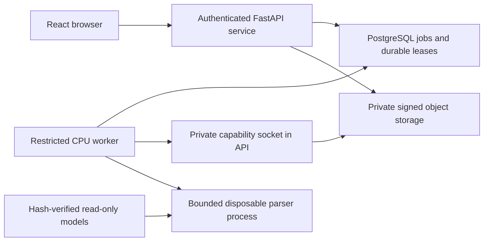

# Phase 2 — real files, conversion and source-linked results

**Scope:** synthetic local development on `saas-phase-2`, based on the completed Phase 1 foundation. [Start on another device](LOCAL-SETUP.md). This phase connects genuine uploads and CPU extraction to the React app. Final review/editing/exports are Phase 3; hosted BYOK, billing and public release remain later phases.

## Customer flow

Create a job → choose fictional files → confirm synthetic data → upload → inspect → enter a PDF password if requested → convert → compare source pages and rows. PDF/JPEG/PNG/TIFF are content-sniffed; filenames never become paths. Job creation offers automatic/text/Docling engines, published profiles, `auto`/DMY/MDY/YMD date order, page groups and image combination. File order is explicit and can be changed before conversion. Owners/editors can upload/queue/cancel/retry; viewers can read originals/results/source pages only.

The UI shows real durable operation states, stages and completed-page counts rather than a made-up percentage. Financial checks/verdicts are separate from source confirmation. Successful extraction always leaves a job `needs_review`: a reconciled balance does not prove dates or descriptions. The previously measured multi-page OCR description mismatch remains a review requirement; it has not been declared fixed. Hosted results are read-only in Phase 2, and no final export action is enabled.

## Service and data boundaries

- Hosted state is PostgreSQL, with scoped job/file/artifact/operation/snapshot relationships. There is no hosted `order.json` authority or CLI subprocess wrapper. The existing filesystem CLI and its parser/Decimal checks remain available and regression-tested.
- `PipelineTask`/operation/artifact protocols define the worker boundary; computation reuses intake, profile detection, page routing, text/Docling extraction, normalization and financial validation. Canonical snapshots preserve exact domain monetary strings and source file/page/engine/fix provenance. API rows exclude raw text/full account identity and reject unsupported monetary scales/field sizes rather than silently rounding.
- Upload transport is **one bounded raw byte stream per request**, with CSRF, idempotency, expected-revision, URL-encoded filename and synthetic-confirmation headers. It avoids multipart disk spooling. Default upload bound is 8 MiB; the supported configuration ceiling is also 8 MiB. Inputs remain quarantined until the isolated parser opens and validates them. Signed storage write/read-back hashes precede inventory publication.
- Defaults: 12 files, 40 pages/job, 512 MiB of workspace inventoried storage including staging, four active operations/workspace and 30 requests/hour. Each queued operation captures its page quota; later configuration changes cannot expand an existing attempt. PDF page count/dimensions and image pixel/frame limits run before rendering. The worker has a 300-second wall/CPU limit, 4 GiB RAM, two CPUs, 128 processes/threads, 512 MiB scratch and bounded result/artifact messages. These are test limits, not prices or verified hosting capacity.
- Originals, normalized PDFs and previews use opaque keys in private storage. Every download/page read rechecks membership, parent job, deletion fence, current revision and content hash. Worker artifact transfers need the current unguessable lease capability and same-workspace/job inventory. The worker receives no S3 credentials, browser sessions, identity credentials or Docker socket.
- A dedicated internal Docker network and explicit local-only DNS upstream deny public TCP **and public DNS resolution**, while allowing the private PostgreSQL service name. Only manifest-approved public model artifacts are copied into `.local-saas/worker-models` with container-readable permissions; private original cache permissions and unlisted setup files remain untouched. This avoids host/container user-number mismatches and adds roughly 700 MB to setup. Root filesystem/models/broker mount are read-only; the worker runs without root/capabilities and with no-new-privileges. Verify these restrictions with `scripts/check-worker-isolation.py`; an offline application flag alone is not the network boundary.
- The parser receives only its task/document bytes/passwords and resource/model limits. Worker DB credentials are scrubbed from inherited environment before process spawning; parser results use bounded validated JSON/base64 rather than an unpickling channel. Document/native diagnostics are suppressed, and scratch is owned by the parent so cancellation/crash cleanup works. The whole worker remains a trusted service identity allowed to claim queued jobs; a separate process is not a claim of a fully hardened native-exploit sandbox. Independent threat review and production isolation hardening remain Phase 6 gates.

## Durable operations and recovery

SQL security-definer claim/heartbeat/publish functions are the worker role's only customer-data interface; direct table reads and DDL are denied. Claims use `FOR UPDATE SKIP LOCKED`, a hashed lease token, generation, 45-second expiry and at most three attempts. A live heartbeat renews the lease; retries reclaim with a new generation. Publication checks actor membership, workspace/job, input revision, generation/token, expiry and deletion state, with the same workspace→job→operation lock order as API writes. A stale/revoked/removed/cancelled attempt cannot publish.

Only one operation may be active per job. Commands are durably replayed by actor/workspace/action/key/payload; changed payloads under the same key conflict. Upload retries retain the same original bytes/name/revision/key in browser memory when acknowledgement is lost. An idempotent replay can return the original acknowledgement; the current operation GET is authoritative for current status. No keys, passwords or private results enter browser storage.

Cancellation fences publication immediately; the parent stops its parser when heartbeat fails. Completed or waiting jobs do not keep a parser alive. Abandoned stage objects are accounted for in quota until the conservative `reap` pass removes them. Passwords live in a five-minute, one-use memory vault; wrong/expired/lost passwords prompt again. When several PDFs have different passwords, verified preceding files/previews are published during the next password wait, avoiding repeated earlier password entry. Passwords never enter snapshots, audit, idempotency bodies, logs or object artifacts.

Cleanup scans at most 1,000 objects per owned prefix per pass with a retained continuation cursor. It considers opaque objects older than an hour, preserves active/original/referenced objects and current live attempts, and retries incomplete deletion. It does not issue a customer deletion certificate or purge backups. Public close/retention/certificates remain future work.

## Canonical representation and migrations

`content_digest` is SHA256 of UTF-8 compact sorted JSON with `{ "v": 1, "data": ... }`. Intake hashes ordered original source SHA256 values plus job options. Extraction hashes ordered source UUID/hash pairs, validated options, the published profile data and tolerance/date/fallback policy, plus ordered statement domain snapshots and CLI-compatible statement versions. It excludes only nondeterministic timings/diagnostics from digest domain data. Monetary values are exact strings. A repeated computation of the same task produces the same digest; source/order/options/domain changes invalidate it. CLI statement `version()` remains unchanged and is stored alongside the hosted digest.

Migrations `0002`–`0005` add file/snapshot inventories, scoped composite artifact pointers, leases/functions, progressive protected-file intake and captured page budgets. Forward upgrades preserve Phase 1 metadata. New function bodies are frozen in their migrations, not imported from mutable application code. Take a matching code/database/storage/credential backup before upgrades. Phase 2 downgrades require restoring that matching backup instead of weakening data/tenant boundaries. Production rollback/restore drills remain Phase 6.

## Validation evidence (10 October 2026, Linux x86_64)

- **51 SaaS integration tests:** actual PostgreSQL and signed storage; isolated test database/bucket, file/operation/row contract responses, A/B and viewer denial, signature/size/page/image/invoice checks, exact replay and concurrency, foreign child/capability rejection, scoped normalized-file FK and wrong-parent preview denial, worker SELECT denial, revoked/stale/cancelled/deletion fences including revocation while staging waits for a lock, retry exhaustion, wrong/two-PDF passwords, storage rollback, conservative cleanup and deterministic snapshots. Three warnings: maintained auth/test-client deprecations and the deliberately oversized-image warning.
- **314 original Python tests** pass, including real offline Docling/OCR and CLI compatibility; strict typing/lint/format pass. Thirteen upstream warnings are unchanged.
- **42 frontend unit tests** pass, including exact monetary-type rejection and raw-upload replay. **19 demo browser journeys** pass without weakening assertions. Two initial whole-route accessibility timeouts occurred under concurrent image-building load; the complete rerun passed after those builds finished.
- Real maintained Keycloak/browser sign-in, cookie/logout, A/B original/page denial, viewer read-only access and actual OTP admin without customer membership pass. Real uploads yield two-row text, six-row alternate text, scanned/image, protected-PDF and two ordered images (including EXIF rotation) results with exact amounts and genuine PNG source pages. Desktop/phone screenshots were visually inspected and the real result view passes automated accessibility/overflow checks.
- Actual running-container probes pass model SHA256 verification, CPU-only PyTorch, denied direct worker table reads, denied public IP connections/DNS resolution and enforced non-root/network/mount/resource settings. Local image/setup is repeatable with signature/TLS verification retained. Container code permissions and its model-manifest packaging were corrected during verification; temporary build cache was cleared without deleting data/model volumes.

The actual worker SIGKILL/restart test also passes: PostgreSQL shows two attempts/generation 2, one successful current revision and one operation after command replay. A full four-service/API restart preserves all 22 jobs, combined-image snapshots and private source PNGs; the final expanded financial-detail view passes mobile accessibility/overflow.

The final [fresh Linux GitHub pipeline](https://github.com/samidoomsday-star/dockling/actions/runs/38037531563) passes installation, all 51 backend tests, the verified model/image build, original converter checks, actual isolation, six genuine conversion cases and SIGKILL recovery. The [frontend workflow](https://github.com/samidoomsday-star/dockling/actions/runs/38036653809) passes against unchanged frontend source. Additional local rerun evidence is recorded in `docs/PROGRESS.md`. Windows/WSL/ARM, real customer documents, general OCR accuracy, hosting load, production backup/restore, billing/LLM requests and public deployment have not been certified by these synthetic checks.

## Next phase

Phase 3 connects correction/review, source attestations, server revalidation and current-revision final exports to these snapshots/source pages. Retain the existing Decimal/source gates, format parity, private artifact verification and financial-versus-description distinction. Phase 4 adds the owner's custom OpenAI-compatible BYOK connections, model picker and highest **supported** effort including Max; unknown capabilities remain provider-default-only. No LLM key is needed for Phase 2 OCR.
