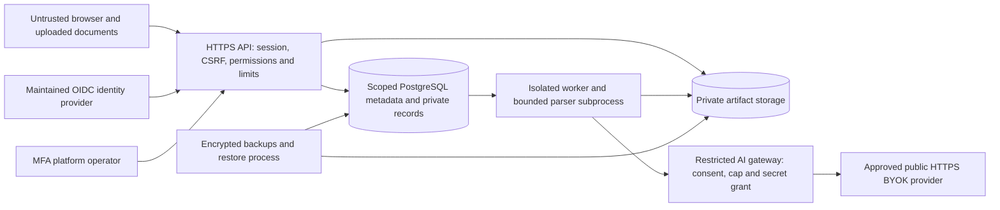

# SaaS security and privacy contract

**Status:** Phase 0 task 0.5 threat/data-flow specification; controls and named tests below remain to be implemented and run. Read with [permissions](FEATURE-MATRIX.md), [data/jobs](DATA-AND-JOBS.md) and [pending operating decisions](DECISIONS.md).

## Trust and network boundaries

Browser input, documents, filenames, workbook cells, provider responses and webhooks are untrusted data. Their contents never become instructions for Codex, shell execution, profiles, server configuration or privileged application actions. The worker uses pinned local models verified during explicit setup; document processing has no arbitrary network route. The gateway alone may contact an approved provider for a current authorized AI request.

## Threat/control/test register

| Threat | Required control | Planned acceptance evidence | Owner / phase |
|---|---|---|---|
| Cross-customer access or forged workspace/role | Server membership and scoped repositories/object authorization; composite tenant FKs; optional proven RLS second barrier | TENANT-DENY, ROLE-DENY; malicious child FK/cursor/worker ID; direct private object URL denied | Engineering / 1 onward |
| Session forgery/recovery takeover/CSRF | Maintained OIDC client; state/nonce/PKCE, issuer/audience/signature validation; server revocation; Secure HttpOnly SameSite cookies; origin/CSRF checks; login/recovery limits; no homemade password crypto | AUTH-SESSION, SESSION-DENY; logout/revoked membership, invalid callback/token, unsafe context switch | Engineering / 1 |
| Overbroad admin/support access | MFA for admin, separate global roles; named jobs/data-class/action grants with expiry/owner approval; revoke on every read; log access metadata | SUPPORT-EXPIRY and no-grant admin content denial; exceptional write grant distinct from read support | Engineering / 4 |
| Upload/parser exploitation and resource exhaustion | Stream limits before allocation; byte signature/content sniff; generated keys; quarantine; page/decompression/time/RAM bounds; nonroot network-disabled parser sandbox; sandbox failure cleanup | INTAKE-SAFE; corrupt/huge/polyglot/password/rotation samples; parser timeout/crash leaves no published artifacts | Engineering / 2, hardened 6 |
| Workbook/CSV formula injection and malicious edit content | Parse expected workbook schema/metadata in bounds; never execute macros/formula commands; neutralize spreadsheet output formula prefixes; reject invalid/stale edits atomically | REVIEW-ATOMIC and SIX-OUTPUTS with formula-like strings; workbook zip/row bounds | Engineering / 3 |
| Stale edit/worker/output or financial bypass | Expected revision + content digest + lease fencing + deletion fence; Decimal rules and source gates server-side | Stale save/workbook/worker denied, checks/output invalidated, hashes verified, no identity override | Engineering / 1–3 |
| Secret/password leak | Write-only key commands; ciphertext with separate deployment key/version or managed KMS; scoped short-lived secret grants; no plaintext queue/browser/log storage; transient PDF password handoff | KEY-ISOLATION/PASSWORD-EPHEMERAL; rotation/revoke/crash/expiry, response/log/export scans | Engineering / 2,4 |
| Custom provider SSRF/DNS rebound/redirect | Canonical public HTTPS endpoints, public IPv4/IPv6 address checks at connection time, controlled DNS/egress proxy, no userinfo/custom proxy/private address/metadata access; reject redirects or validate/pin each hop; TLS verify | ADAPTER-EGRESS using private/link-local/loopback/reserved/IPv6/encoded addresses and DNS/redirect adversarial fakes | Engineering / 4 |
| Provider data exposure/untrusted output/cost replay | Minimized masked eligible cells, terms+bound consent, no sample content in metadata test; bounded response/schema validation; reservation before send; uncertain result not auto-repeated | CONSENT-CAP, fake paid timeout/restart, no consent means no network; unsafe/no-cell case offers manual review | Engineering / 4 |
| Deletion false-success and reappearance after recovery | Authoritative inventory, immediate access revocation, operation fence, retry; remove object versions/TMP; success only after checks; durable deletion tombstones replayed during restore | DELETE-COMPLETE/ABANDON-FENCE; forced failures; restore backup then purge tombstones before opening service | Engineering / 3,6 |
| Billing tamper or webhook replay | Merchant-hosted checkout, signed provider events, idempotent ledger and current entitlement policy; bind verified customer/payment references | WEBHOOK-ORDER, invalid signature, duplicate/out-of-order/refund/cancel cases; billing owner-only | Engineering / 5 |
| Supply-chain/model/network compromise | Pinned reviewed dependencies, model hashes and separate terms; build scans/SBOM, nonroot minimal images and managed secrets; maintenance egress separate from processing | Verified fresh build/model check; forbidden processing network and unreviewed download routes | Engineering / 1,6 |
| Private logs/support exports/backups | Allowlists for structured metadata, safe error codes/request IDs, no raw payload/amount/source/alias/key; encrypted backups with access control and tested expiry | Log/secret scans on failure cases; redacted support bundle; unauthorized backup access denied | Engineering / every phase |

## Data and deletion inventory

| Data class | Live storage and allowed access | Removal/retention contract |
|---|---|---|
| Originals, filenames/account-bearing upload metadata | Private objects and scoped DB; authorized O/E/V and explicitly scoped support | Immediate download revocation on request; delete original versions, metadata and multipart/temporary uploads |
| Unlocked/normalized/composite documents, OCR/text/row snapshots and source previews | Private OBJ/DB/TMP; scoped parser/worker and permitted members | Inventory every derivative, attempt and revision; remove thumbnails/render caches, scratch and abandoned artifacts |
| Review workbooks, histories, exports, ZIPs and notes | Private OBJ/DB; current revision permission; private historical values retained only while job exists | Delete all versions, prior artifacts and protected history content; invalidate cached download links and CDN responses (private files are never public-cacheable) |
| PDF passwords and BYOK keys | Expiring encrypted password handoff; vault ciphertext and separate encryption material; no normal read API | Consume/expire password handoff and wipe scratch best-effort; remove scoped secrets on owner revoke; provider-side issued credentials require owner revocation at that provider too |
| Consent/page reservations and job queue payload | Scoped DB with minimal IDs/configuration; no credentials/source cells in queue | Fence active work, scrub private context on completion/removal; keep only policy-approved minimal event records |
| Audit/certificate/deletion tombstones | Separate restricted minimal metadata; no description/alias/account/amount/key | Certificates describe verified live removal only. Pseudonymous IDs/digests are still protected records, not automatically anonymous. Minimal tombstones last long enough to prevent backup resurrection; define policy before real data |
| Customer identity/membership/billing/support communications | Scoped service records with privacy-request process; no customer statements in notices | Workspace/job removal differs from account removal. Explain legally required billing retention and independent identity/payment-provider records before sale |
| Metrics/logs/backups | Scrubbed aggregates and short policy-defined log retention; encrypted backups with separate credentials | No private content in metrics. Logs use safe identifiers only. Backups expire on an approved schedule; restoration applies deletion tombstones and inventory checks before service access |

Application deletion is logical removal of inventoried live copies; it cannot promise forensic erasure of SSD media, instant immutable-backup expiry, remote provider retention or downloaded customer copies. Explain these facts in customer terms. A pending/partial cleanup never returns a success certificate. Provider retention and data transfer terms must match the chosen market and explicit consent.

## Operating-policy gates

Before receiving real customer documents, select the actual data region/providers, legal/processor terms, retention/backup expiry and responsible support operator; prove tenant isolation, parser bounds, vault/egress where AI is enabled, and restore/deletion behavior on that topology. US/Europe are likely markets per owner, not a finalized jurisdiction/region decision. Do not imply GDPR, SOC 2 or other certification from this threat model or test count.

Use OWASP ASVS and the File Upload Cheat Sheet as implementation/review references. Independent security review and operational drills in Phase 6 are required evidence; this internal Phase 0 specification is not that external review.
